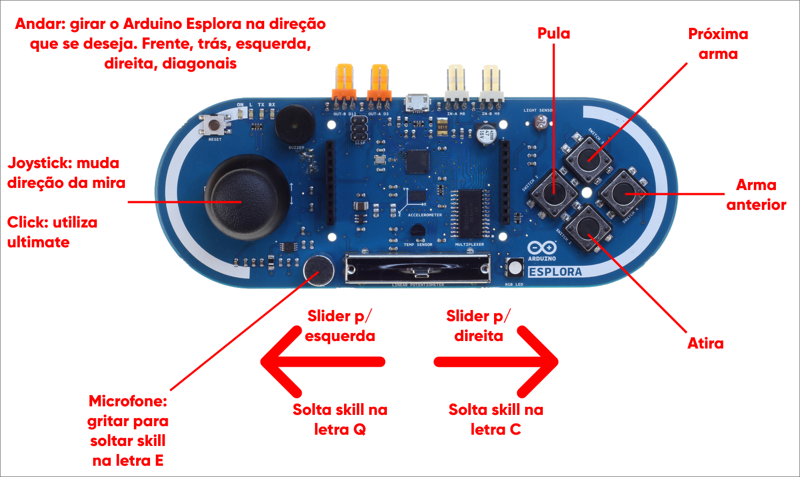

<h1 align="center">
  
</h1>

---

<!-- 

-->

  

  

  

  

<h3 align="center">
  Uso do Arduino para um projeto interativo e divertido.
</h3>

## Índice

+ [Sobre](#sobre)
  + [Arduino Esplora](#arduino-esplora)
+ [Primeiros Passos](#comecando)
  + [Pré-requisitos](#pre_req)
  + [Instalação](#instalacao)
+ [Uso](#uso)
+ [Melhorias](#todo)

<h2 id="sobre">Sobre</h2>

O controle programável foi feito com o objetivo de entreter e jogar Valorant utilizando Arduino, como pode ser visto no gif abaixo.

    
    
Figura 1. Exemplo de jogabilidade com Arduino Esplora

Realizado durante as lives da twitch no <a href="https://twitch.tv/bittoin">canal BitToin</a>, foi um projeto que utilizou o jogo Valorant, da Riot Games, como exemplo de aplicação que pode ser controlada e influenciada pelo Arduino apenas para fins de entretenimento. Embora o Arduino seja utilizado em projetos, pesquisas e trabalhos sérios, é importante lembrar que também é muito utilizado em hobbies e passa tempos!

<h3 id="arduino-esplora">Arduino Esplora</h3>

O Arduino Esplora foi escolhido para o projeto pois é um Arduino feito para que possamos construir protótipos sem precisar montar circuito algum! Além disso, esse Arduino possui a capacidade de "imitar" um mouse e um teclado. Com isso, podemos programar para que as ações dos botões, joystick e afins, possam reproduzir resultados como se fossem clicks e movimentos de mouse e teclado no computador.

<h2 id="comecando">Começando</h2>

Siga estas instruções para criar, replicar e modificar o modelo do projeto na sua máquina.

<h3 id='pre_req'>Pré-requisitos</h3>

> - Arduino Esplora (display não necessário)
> - Arduino IDE 1.8.13 ou PlatformIO

<h2 id="uso">Uso</h2>

Basta abrir o código encontrado na pasta <a href="https://github.com/bittoin/Controle-Programavel-para-Valorant/tree/main/control_valorant_esplora"> Control Valorant Esplora</a> dentro da IDE do Arduino e realizar o upload na placa.

A imagem abaixo indica todos os comandos que podem ser feitos para jogar baseado no código feito.

    
    
Figura 2. Comandos do controle baseado no código disponibilizado

<h2 id='todo'>Features</h2>

- [x] Andar em todas as direções
- [x] Mirar em todas as direções
- [x] Atirar
- [x] Pular
- [x] Soltar skills
- [x] Trocar armas
- [x] Utilizar ultimate ultimate

## Licença

Copyright © 2021 [Mateus Antonio da Silva](https://github.com/bittoin). 
This project is [MIT](https://github.com/bittoin/Qt-GUI-for-Arduino/blob/main/LICENSE) licensed.